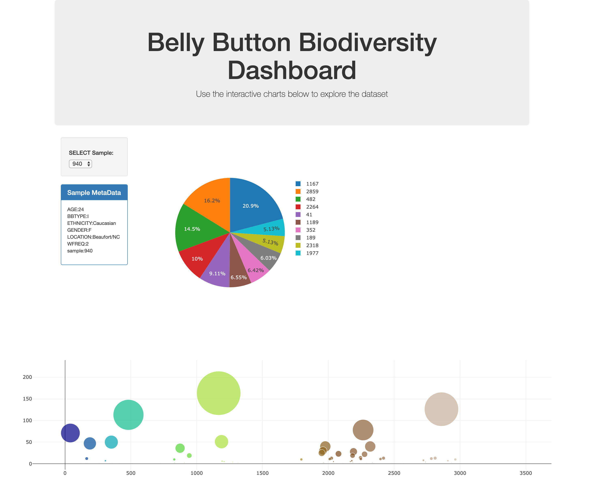

# Belly Button Diversity
https://belly-button-diversity.herokuapp.com/
## Background
Build an interactive dashboard with Plotly.js and Flask to explore the Belly Button Biodiversity DataSet.
## Objectives
1. Create a PIE chart that uses data from your samples route (`/samples/<sample>`) to display the top 10 samples.
* Use `sample_values` as the values for the PIE chart.
* Use `otu_ids` as the labels for the pie chart.
* Use `otu_labels` as the hovertext for the chart.

2. Create a Bubble Chart that uses data from your samples route (`/samples/<sample>`) to display each sample.
* Use `otu_ids` for the x values.
* Use `sample_values` for the y values.
* Use `sample_values` for the marker size.
* Use `otu_ids` for the marker colors.
* Use `otu_labels` for the text values.
 3. Display the sample metadata from the route `/metadata/<sample>`
* Display each key/value pair from the metadata JSON object somewhere on the page.
4. Update all of the plots any time that a new sample is selected.
## Preview

